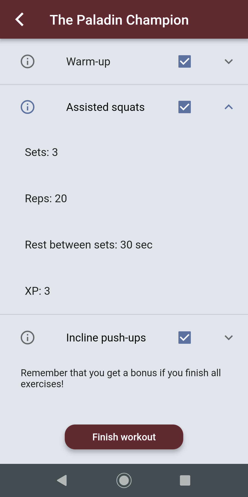

# Heroes of the Gym

Heroes of the Gym is a mobile app for iOS and Android developed using the framework Flutter. This application combines exercise with role-playing game elements (RPGs) in order to increase motivation. A workout plan is generated for the user after signing up based on personal fitness level and a specified goal. The user earn experience points (xp) by completing selected workouts, and can follow the progress of his/her game character. Instead of waiting for the slow progress that happens in real life, the user will be able to see the continuous progress shown in the application.

Some screenshots of the application in use: 

<p float="left">
  
  
  
  
</p>
<p float="left">
  
  
  
  
</p>

## Getting Started
These instructions describe how you can install and run the project on your local machine for further development and testing.

### Prerequisites
Before you can run the project you have to make sure you have installed all the prerequisites. 

#### SDK
* [Flutter](https://flutter.dev/docs/get-started/install)


#### Development tools
* Code editor (we recommend [VS Code](https://code.visualstudio.com/) or [IntelliJ](https://www.jetbrains.com/idea/)

Depending on what device you want to use during development, you need either one or both of these tools: 
* Android devices: [Android Studio](https://developer.android.com/studio)
* iOS devices: [Xcode](https://itunes.apple.com/us/app/xcode/id497799835?mt=12)

Once you have installed either one or both you need to create a device simulator.
* [How to create an Android device](https://developer.android.com/studio/run/emulator)


#### Cloud Functions
For writing and deploying Google Cloud Functions, you'll need node.js and FirebaseCLI.

* [Node.js](https://nodejs.org/en/)
* To install FirebaseCLI, run: ```npm install -g firebase-tools```.

For more information about Cloud Functions, see https://firebase.google.com/docs/functions/get-started. 


### Installing
Open a terminal window and clone the repository.

```
git clone git@github.com:marose14/heroes.git
```

Open the repository in your code editor. Install the necessary packages by running:

```
flutter packages get
```

Make sure a simulator is connected and running. cd to the folder heroes_app and start the project by running:

```
flutter run
```

### Running the emulator
When having installed Xcode and Android Studio, this is how you run the project on the emulator. 

#### Xcode
In the top left, change 'Generic iOS Device' to the preferd iOS simulator. Then click the 'play' button to build and run the code on the emulator. 

#### Android Studio
In the menu bar, click the 'AVD Manager' button and start the virtual device you made in an earlier step. Then make sure 'main.dart' and your device is selected in the menu bar. Click the 'play' button to run the code on the emulator.    

## Running the tests

There are two types of automated tests in this project, unit tests and integration tests.

### Unit tests
The unit tests test the smallest testable parts of the code. The purpose of such a test is to verify the correctness of a unit of logic under a variety of conditions. To do this we have used the integrated testpackage for Dart code, which provides the core framework for writing unit tests.

To run all the tests, in the heroes_app folder run the following command:

```
flutter test test/unit/
```

You can also run one test at a time by running this command:

```
flutter test test/unit/filename.dart
```

### Integration tests
Integration testing is used for testing if the individual smaller parts work together. We have used Flutter’s own package flutter_driver to make the tests. These tests open a simulator, and "use" the application, testing that the right messages and widgets are shown on the screen when certain inputs are entered and buttons are tapped.

To run the tests, in the heroes_app folder run the following command:

```
flutter drive --target=test_driver/app.dart
```

After running the tests you will need to reset the database. This can be done by going to the following url, which will fire the cloud function resetTestUser: https://us-central1-heroes-6fe69.cloudfunctions.net/resetTestUser.

## Deployment

Add additional notes about how to deploy this on a live system

## Contributors

### Project owners
* Anders Wilhelmsen Carter (Personal trainer)
* Dag Frode Solberg (IT-consultant)

### Developers
* Astrid Vik
* Hanna Evensen
* Hedda Nikolaisen Holmen
* Lena Tørresdal
* Marianne Voss Siljan
* Maria Osen
* Therese Hansen Federl

## License
© Azero AS. 

